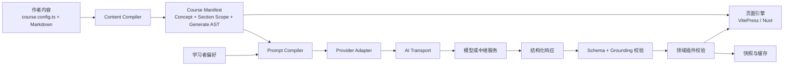

# Gentorial 实施计划

> 项目：Gentorial（衍课）
> 口号：用教学规范生成每个人自己的教程。
> 文档状态：实施基线
> 更新日期：2026-07-12

## 0. 当前交接状态

仓库位置：`D:\Projects\gentorial`

已经建立：

- npm monorepo 根目录与 `pnpm-workspace.yaml`。
- 根 `package.json`、TypeScript 基础配置、MIT 许可证和 `.gitignore`。
- pnpm 锁文件与显式依赖构建白名单。
- Changesets 基础配置与 Windows/Ubuntu、Node 22/24 GitHub Actions CI 矩阵。
- Git 仓库，默认分支为 `main`。
- 中英文根文档 `README.md` 与 `README.zh-CN.md`。
- 下列包均已具备 `package.json`、TypeScript 入口、README、测试、构建脚本和可检查的 npm tarball：
  - `packages/core`
  - `packages/content`
  - `packages/ai`
  - `packages/runtime-vue`
  - `packages/engine-vitepress`
  - `packages/theme-default`
  - `packages/create`
  - `packages/server`
- `examples/minimal` 已打通概念锚点、章节范围、标题旁纯图标入口、原文后正文直出、结果末尾常驻追问输入、全局学习者偏好、显式生成错误与 VitePress 构建；未配置 BYOK 时不会生成替代内容。
- `apps/website` 已建立 React + Tailwind CSS + Lucide 的 monochrome 静态官网技术骨架，目前只保留最小页面壳，不预设官网文案或内容结构。
- 日常完整验证命令为 `pnpm check`。
- 工作区根包和全部公开包当前版本均为 `0.0.0`；尚未发布任何 npm 包。

尚未进行：

- VitePress 引擎尚未在构建入口消费完整的课程目录清单。
- 最小示例尚未加入故意返回错误结构的页面级交互验收。
- `@gentorial/create` 当前是可打包的非交互模板初始化器，完整交互、安装与 tarball 端到端流程仍待阶段 4 完成。
- 已接入 OpenAI、Anthropic、Google 与 OpenAI-compatible 的浏览器会话 BYOK；生产级本地/服务端中继与作者快照尚未实现。
- 尚未发布任何 npm 包。

继续本项目时，先完整阅读本文，再按“阶段 1”中的剩余任务推进。不要为了快速演示而把 AI、页面引擎或领域校验写进核心包。

## 1. 产品定义

Gentorial 不是“在文档站里放一个聊天框”，而是一套可发布、可扩展的生成式教程框架。

作者负责两类内容：

1. **教学事实**：必须明确出现、不能由模型自行发明或替代的概念、边界和标准要求。
2. **生成意图**：用短提示描述希望为学习者生成的讲解、示例、比较、练习或反馈。

框架负责：

1. 将课程配置、教学事实、局部提示和学习者偏好编译成受约束的请求。
2. 通过可替换的提供方适配器与传输层接入模型。
3. 只接受结构化课程块，并在渲染前执行协议校验、概念对齐和领域校验。
4. 在无 AI、离线、请求失败或校验失败时保留作者原文；默认结果位置保持为空，自定义集成可选择快照或回退块。
5. 让同一份课程内容可运行于 VitePress 静态模式，以及未来的 Nuxt 应用模式。

### 1.1 作者体验

第一版目标体验：

```bash
npm create @gentorial@latest my-course
cd my-course
npm run dev
```

作者主要接触：

- `course.config.ts`
- `content/**/*.md`
- `public/`
- 少量主题配置

作者不应被要求理解提供方请求格式、Vue 注入机制、Markdown-it token 或 VitePress 内部接口。

### 1.2 学习者体验

- 页面首先呈现作者明写的概念锚点与章节原文。
- 作者启用生成的章节在标题旁显示低干扰触发器，生成结果默认在对应原文之后作为普通正文直接出现。
- 学习者可以填写自己的背景与目标，并通过全局 `detail`、`tone`、`narrative` 等偏好控制表达方式。
- 每个生成区块独立请求、取消、重试和恢复。
- 主结果只显示 `GeneratedLesson` 内容本身，不显示 `✦`、“个性化讲解”等标签、标记、背景、边框或可见状态文字。
- 重新生成替换原主结果，不修改作者原文，也不重复追加结果。
- 讲解出现后，结果末尾常驻带“继续追问…” placeholder 的单行输入和“发送”按钮；不把点击教程正文作为发现入口。Enter 或按钮提交，Esc 取消活动请求并清空草稿，输入组合持续保留。
- 学习者问题、“你”“回应”等角色标签不进入可见正文；通过校验的 assistant 回答只作为新的 `GeneratedLesson` 结构化块顺序出现。
- 追问仍受原章节范围、概念与课程策略约束。
- 重新展开主讲解成功后，清空绑定旧讲解的对话；失败或取消时不提前丢弃仍可阅读的旧结果。
- 生成结果以受控课程块呈现，不注入任意脚本、HTML 或组件代码。
- 首次生成失败时结果位置保持为空，作者原文不变；默认界面不显示错误或回退说明，可保留不可见 ARIA 语义。

### 1.3 第一版不做什么

- 不做通用 CMS。
- 不做完整 LMS、账号体系、付费、班级管理和学习数据后台。
- 不让模型重写整门课程。
- 不承诺自动判断所有事实真伪；框架提供约束与校验机制，领域插件逐步增强。
- 不把 Nuxt 和 VitePress强行运行在同一个渲染进程中。
- 不在浏览器产物中保存作者密钥。

## 2. 不可破坏的设计原则

### 2.1 概念明文，叙事生成

概念锚点属于课程规范。生成内容可以解释、举例、类比或提问，但不能取代、隐藏或反转锚点。

`ConceptAnchor` 与 `SectionScope` 必须区分：前者是作者显式确认、具有稳定 ID 的教学事实；后者是某次生成所依据的作者章节原文和主题边界。章节范围可以限制“允许讲什么”，但不会自动把其中每一句都提升为独立概念断言。两者都属于作者内容，生成过程不得改写。

### 2.2 框架抽象，局部提示具体

局部提示使用最短充分表达。例如：

```md
::: generate switch-range kind=example concepts=switch-discrete
switch 不适合直接判断连续范围（比如成绩区间）。
:::

::: generate switch-table kind=example concepts=switch-discrete
多个选项分支基本相同，可以使用表驱动。
:::
```

准确性、语言标准、输出结构和禁止事项由课程级策略和插件统一补入，不要求作者在每个区块重复。

### 2.3 结构化结果优先

模型返回 `GeneratedLesson`，其中只包含已登记的课程块类型。首批块类型：

- `paragraph`
- `heading`
- `list`
- `code`
- `callout`
- `comparison`

禁止把模型返回的任意 HTML、Vue 模板或脚本直接交给页面。

### 2.4 引擎可换，内容不换

课程配置、内容 AST、生成协议和校验协议不能依赖 VitePress。VitePress 只是 `engine-vitepress` 的实现细节。

### 2.5 默认安全的 BYOK

- 作者构建时密钥只从进程环境或受控密钥服务读取。
- 学习者按需生成时，默认走服务端或本地中继。
- 浏览器直连属于高级模式，必须显式开启并展示风险说明。
- 密钥不进入 Git、静态产物、课程清单、浏览器日志或错误遥测。

### 2.6 失败时仍是一份教程

概念锚点和章节原文始终可见。默认无感界面首次生成失败时不显示错误、状态文字或回退块，结果位置保持为空；已有合法结果在刷新失败或取消时继续保留。框架仍支持静态快照与作者回退块，但它们由自定义集成显式选择，不属于默认 UI。

### 2.7 追问继承同一教学边界

多轮追问不是脱离教程的通用聊天。它必须继承当前主讲解的 `SectionScope`、引用的 `ConceptAnchor`、课程准确性策略、learner profile 和已生成讲解，并在内部携带此前对话轮次。默认页面不把这些轮次渲染成聊天记录：用户问题与角色标签不可见，每次 assistant 回复仍使用 `GeneratedLesson`，通过相同的结构、`sourceIds`、`conceptIds` 和领域插件校验后，才作为下一段正文顺序出现。

## 3. 顶层架构



### 3.1 分层与依赖方向

| 层 | 包 | 可以依赖 | 不得依赖 |
| --- | --- | --- | --- |
| 协议层 | `@gentorial/core` | Zod 等通用协议库 | Vue、VitePress、Nuxt、提供方 SDK、文件系统 |
| 内容层 | `@gentorial/content` | core；Node 子入口可用文件系统 | 页面引擎、模型提供方 |
| AI 层 | `@gentorial/ai` | core | Vue、VitePress、Nuxt |
| 运行时层 | `@gentorial/runtime-vue` | core、Vue | VitePress 内部接口、提供方 SDK |
| 引擎层 | `@gentorial/engine-vitepress` | core、content、VitePress | 具体模型提供方 |
| 主题层 | `@gentorial/theme-default` | runtime-vue、VitePress | 内容编译内部实现 |
| 工具层 | `@gentorial/create` | Node API、交互库 | 运行时内部实现 |
| 领域层 | `@gentorial/plugin-c`（后续） | core 的插件协议 | 页面引擎内部实现 |

依赖只能从外层指向稳定内层。不得让 `core` 为某个引擎或模型提供方增加专属分支。

## 4. 计划中的仓库结构

```text
gentorial/
├─ .changeset/
├─ .github/workflows/
├─ apps/
│  └─ website/                   # React + Tailwind + Lucide 静态官网
├─ docs/                         # 框架自身文档，阶段 4 建立
├─ examples/
│  └─ minimal/                   # 纵向贯通示例
├─ packages/
│  ├─ core/
│  ├─ content/
│  ├─ ai/
│  ├─ runtime-vue/
│  ├─ engine-vitepress/
│  ├─ theme-default/
│  ├─ create/
│  └─ plugin-c/                  # 阶段 3 再建立，不发布空包
├─ PLAN.md
├─ README.md
├─ package.json
├─ pnpm-lock.yaml
├─ pnpm-workspace.yaml
└─ tsconfig.base.json
```

每个公开包至少需要：

- `package.json`
- `README.md`
- `src/index.ts`
- `tsconfig.json`
- 测试
- 明确的 `exports`
- `files: ["dist"]`
- `publishConfig.access: "public"`
- 构建后可独立 `npm pack` 的产物

## 5. 核心内容协议

所有公开协议带 `schemaVersion`。破坏兼容性的变更必须提升协议版本，并提供迁移诊断。

### 5.1 `CourseDefinition`

首版建议字段：

```ts
type CourseDefinition = {
  schemaVersion: '1'
  id: string
  title: string
  description?: string
  lang: string
  contentDir: string
  generation: {
    mode: 'snapshot' | 'on-demand' | 'hybrid'
    defaultLocale: string
  }
  accuracy: {
    policies: string[]
    standards?: string[]
  }
  plugins?: GentorialPlugin[]
}
```

推荐作者接口：

```ts
import { defineCourse } from '@gentorial/core'

export default defineCourse({
  schemaVersion: '1',
  id: 'c-language',
  title: 'C 语言教程',
  lang: 'zh-CN',
  contentDir: 'content',
  generation: {
    mode: 'hybrid',
    defaultLocale: 'zh-CN'
  },
  accuracy: {
    standards: ['ISO C17'],
    policies: [
      '概念锚点的结论不可被反转',
      '示例代码应说明适用前提'
    ]
  }
})
```

### 5.2 `ConceptSpec`（`ConceptAnchor`）

```ts
type ConceptSpec = {
  id: string
  title?: string
  statement: string
  source: SourceLocation
}
```

`statement` 保存作者明确确认的教学事实。提示编译器可引用它，但任何生成结果都不能改写源内容。本文使用 `ConceptAnchor` 表示这种产品语义，首版公开协议类型仍命名为 `ConceptSpec`。

### 5.3 `SectionScope`

```ts
type SectionScope = {
  type: 'section'
  id: string
  heading: string
  level: 1 | 2 | 3 | 4 | 5 | 6
  markdown: string
  source: SourceLocation
}
```

`SectionScope` 保存最近标题与生成指令之间的作者 Markdown，用来限定本次生成的主题和材料范围。它与概念锚点的区别是：范围原文不必逐句声明为不可反转的事实，但模型仍不得越出该范围，也不得修改页面上的作者原文。编译器为范围分配稳定 ID，使结果可以通过 `grounding.sourceIds` 声明依据。

### 5.4 `GenerateSpec`

```ts
type GenerateSpec = {
  id: string
  kind: 'explanation' | 'example' | 'comparison' | 'exercise' | 'feedback'
  prompt: string
  concepts: string[] // 可以为空数组；未写 concepts= 时由编译器填入 []
  scope: SectionScope
  trigger: {
    type: 'heading'
    source: SourceLocation
  }
  output: {
    placement: 'after-source'
    mode: 'replace'
  }
  source: SourceLocation
}
```

编译期必须检查：

- `id` 在当前课程内唯一。
- `concepts` 可以为空；非空时每个引用都必须存在。
- `prompt` 非空。
- `scope.markdown` 非空，并能追踪到最近标题与作者原文。
- `trigger` 能绑定到该标题；首版只接受 `heading`。
- `output` 首版固定为 `after-source` + `replace`。
- 指令闭合，元信息格式正确。
- 源位置可追踪到文件和行号。

### 5.5 Markdown 写法

```md
## switch 的适用边界

::: concept switch-discrete title="switch 的适用边界"
`switch` 根据整数类型表达式经整数提升后的离散结果选择分支。
:::

::: generate switch-range kind=example concepts=switch-discrete
switch 不适合直接判断连续范围（比如成绩区间）。
:::

## C 的历史

1. ALGOL、CPL、BCPL
2. B
3. C

::: generate c-history kind=explanation
沿这条语言演化链解释 C 的形成过程，以及各阶段留下的关键设计影响。
:::
```

规则：

- `concept` 的正文直接渲染，不能只进入隐藏提示。
- `generate` 的正文是局部提示；是否展示提示由主题决定。
- `generate` 默认绑定它之前最近的 Markdown 标题；编译器将标题和指令之间的作者原文编译为 `SectionScope`。
- `concepts=` 可以省略；此时仍以 `SectionScope` 限定内容，并生成空的 `concepts` 数组。
- 默认 `trigger.type` 为 `heading`。标题入口的最终视觉只能是纯 `✦` 图标：无可见“生成”文字、无背景、无边框；hover / focus 只调整颜色或透明度，无障碍名称为“按需展开”。
- 默认 `output.placement` 为 `after-source`：指令应位于所需作者原文之后，`GeneratedLesson` 块在该位置作为普通正文直接渲染。
- 默认 `output.mode` 为 `replace`：重新生成只替换旧生成区域，不追加副本，也不改写作者原文。
- 默认结果不得显示 `✦`、“个性化讲解”等标签或标记，不添加容器背景、边框，也不显示加载、错误等状态文字；仅保留 `GeneratedLesson` 内容本身和不可见 ARIA 语义。
- 元信息放在起始行，不在正文中发明 YAML 子语法。
- 首版不允许指令相互嵌套。
- 解析器必须保留源位置并给出面向作者的诊断。

### 5.6 `GeneratedLesson`

```ts
type GeneratedLesson = {
  schemaVersion: '1'
  title?: string
  blocks: LessonBlock[]
  grounding: {
    conceptIds: string[]
    sourceIds: string[]
    notes?: string[]
  }
}
```

校验要求：

- 必须符合 Zod 协议，不接受额外的可执行内容。
- `grounding.conceptIds` 必须覆盖当前 `GenerateSpec` 的全部概念引用。
- 不得引用课程清单中不存在的概念。
- `grounding.sourceIds` 必须包含当前 `GenerateSpec.scope.id`，且不得引用输入中不存在的来源。
- 追问的 assistant `GeneratedLesson` 必须继续覆盖同一主讲解要求的概念与章节来源，不得借对话引入未知 `conceptIds` 或 `sourceIds`。
- 每种课程块执行长度、语言标识和必填字段检查。
- 领域插件可返回 `error`、`warning`、`info` 三档诊断。
- 存在 `error` 时不渲染模型结果。首次失败时默认结果为空；刷新失败时保留上一个合法结果。快照或回退内容只能由自定义集成显式启用。

## 6. 包的公开接口草案

接口名称在 `0.1.0` 前可以调整，但依赖方向不得调整。

### 6.1 `@gentorial/core`

```ts
export { defineCourse } from './course.js'
export {
  courseDefinitionSchema,
  conceptSpecSchema,
  learnerProfileSchema,
  sectionScopeSchema,
  generateTriggerSchema,
  generateOutputSchema,
  generateSpecSchema,
  generatedLessonSchema
} from './schemas.js'
export type {
  CourseDefinition,
  CourseManifest,
  ConceptSpec,
  LearnerProfile,
  SectionScope,
  GenerateTrigger,
  GenerateOutput,
  GenerateSpec,
  GeneratedLesson,
  LessonBlock,
  GentorialPlugin,
  ValidationDiagnostic
} from './types.js'
```

核心包必须同时可在 Node 和浏览器中导入，且导入时没有文件访问、网络请求或全局副作用。

### 6.2 `@gentorial/content`

```ts
export { parseLessonSource } from '@gentorial/content'
export { compileCourseDirectory } from '@gentorial/content/node'
```

- 默认入口只做纯文本解析。
- `node` 子入口负责遍历目录、读取 UTF-8 文件、生成清单和内容哈希。
- 不在该包里放 VitePress 专属的 Markdown-it 渲染代码。

### 6.3 `@gentorial/ai`

```ts
export {
  compileGenerationPrompt,
  createBrowserByokGenerator,
  createGenerationPipeline,
  createProviderGenerator,
  createRemoteGenerator
} from '@gentorial/ai'
```

关键协议：

```ts
interface PromptCompiler {
  compile(input: GenerationInput): CompiledPrompt
}

interface ProviderAdapter<TRequest, TResponse> {
  id: string
  createRequest(prompt: CompiledPrompt): TRequest
  readStructuredResult(response: TResponse): unknown
}

interface AITransport<TRequest, TResponse> {
  send(request: TRequest, context: TransportContext): Promise<TResponse>
}
```

`ProviderAdapter` 只理解模型提供方格式，`AITransport` 只负责请求如何送达。两者不可合并，否则浏览器、本地中继、服务端和测试替身会相互耦合。

### 6.4 `@gentorial/runtime-vue`

```ts
export {
  createGentorialRuntime,
  GentorialConcept,
  GentorialGenerateTrigger,
  GentorialGeneratedRegion,
  GentorialPreferences,
  GentorialGenerate,
  LessonBlockRenderer
} from '@gentorial/runtime-vue'
import type { LessonConversationTurn } from '@gentorial/core'
```

运行时只接收统一的生成函数，不导入任何具体提供方 SDK。`GentorialGenerateTrigger` 放在标题旁并负责生成、取消、重试和重新生成；`GentorialGeneratedRegion` 位于作者原文之后，将主讲解和已校验的 assistant 追问回复作为普通 `GeneratedLesson` 块顺序直出。它不渲染结果标签、容器装饰、可见状态、用户问题或角色名称，也不默认显示 fallback。`GentorialPreferences` 管理全局 `detail`、`tone`、`narrative` 偏好。`GentorialGenerate` 暂时保留为兼容组合组件，新引擎应使用分离的触发器与输出区域。

已实现的结构化对话协议与运行时方法：

```ts
type LessonConversationTurn =
  | {
      role: 'user'
      content: string
    }
  | {
      role: 'assistant'
      lesson: GeneratedLesson
    }

interface GentorialRuntime {
  ask(generateId: string, question: string): Promise<void>
  cancelFollowUp(generateId: string): void
}
```

- `ask` 使用当前主讲解绑定的同一 `SectionScope`、概念锚点、课程策略和 learner profile，并传入当前讲解与已有 `LessonConversationTurn[]`。
- `LessonConversationTurn` 是内部上下文协议；默认 UI 不显示 `user.content`，也不显示“你”“回应”或其他角色标签。
- assistant 轮次的 `lesson` 必须经过完整 `GeneratedLesson` 与 grounding 校验后，才能作为下一组普通课程块追加到正文。
- `cancelFollowUp` 只取消当前追问，不删除已经通过校验的主讲解或历史轮次。
- 新主讲解生成成功后，运行时替换主讲解并清空其旧 `LessonConversationTurn[]`；生成失败或被取消时保留旧讲解和对话。
- 有主讲解时，结果区域末尾常驻一个单行输入和“发送”按钮；输入使用“继续追问…” placeholder，不依赖点击或聚焦教程正文来发现。
- Enter 或“发送”提交并清空输入，Esc 取消活动请求并清空草稿；输入组合不会因提交或取消而隐藏，学习者问题也不渲染到正文。活动请求仍可通过 `cancelFollowUp` 取消。
- 首次生成失败时结果区域保持为空；状态可以通过不可见的 `aria-busy`、`aria-live` 等语义表达，但不能显示加载或错误文字。自定义集成仍可消费 `fallback` 能力。

### 6.5 `@gentorial/engine-vitepress`

```ts
export { gentorialMarkdown } from '@gentorial/engine-vitepress'
```

职责：

- 作为原生 VitePress `markdown.config` 回调安装扩展，不引入第二套站点配置。
- 安装 `concept` 与 `generate` 的 Markdown-it 容器规则。
- 将 Mermaid fence 交给默认主题的惰性渲染组件。
- 在构建时编译课程清单。
- 将页面所需的最小清单交给客户端运行时。
- 把编译诊断映射为带文件和行号的 VitePress 构建错误。

### 6.6 `@gentorial/theme-default`

```ts
export { createGentorialTheme } from '@gentorial/theme-default'
```

职责：注册 Vue 组件、样式和无障碍交互。标题入口使用液态小球表达生成状态，成功后提供重新生成、复制、反馈与展开/收起操作。结果正文沿用正文排版；讲解末尾常驻轻量输入组合。主题还负责按需加载 Mermaid 客户端渲染器，但不直接请求模型。

### 6.7 `@gentorial/create`

提供：

```bash
npm create @gentorial@latest my-course
```

脚手架模板必须随 npm 包发布，不能在初始化时依赖 GitHub 主分支或远程压缩包。

## 7. AI 管线详细设计

### 7.1 八个阶段

1. **解析**：从课程清单取得 `GenerateSpec`、对应 `SectionScope` 及其引用的 `ConceptSpec`。
2. **编译**：合并课程级准确性策略、章节范围原文、可选概念原文、局部提示、学习者偏好和输出协议。
3. **适配**：`ProviderAdapter` 将通用提示转换为提供方请求。
4. **传输**：`AITransport` 决定直连、服务端、中继、测试替身或离线快照。
5. **提取**：适配器只提取结构化结果，不把整段文本直接交给页面。
6. **协议校验**：Zod 校验 `GeneratedLesson`。
7. **语义对齐**：检查概念覆盖、未知引用和课程级规则。
8. **领域校验与交付**：插件检查代码或领域规则，通过后写缓存并渲染。

### 7.2 编译后的提示必须包含

- 框架协议版本。
- 当前生成区块的类型与目标。
- 当前 `SectionScope` 的标题、作者 Markdown 和稳定 ID。
- 作者明写且由本任务引用的概念原文和稳定 ID；没有显式概念引用时可以为空。
- 课程级准确性策略与标准版本。
- 学习者偏好；它只能影响表达方式，不得覆盖事实约束。
- 允许的课程块 JSON Schema。
- 禁止返回 HTML、脚本、组件代码和协议外字段的要求。
- 要求在 `grounding.conceptIds` 中声明实际概念依据，并在 `grounding.sourceIds` 中声明当前章节范围。

### 7.3 多轮追问

追问输入在主生成输入之上增加当前已校验主讲解、学习者问题和已有 `LessonConversationTurn[]`。它不得重新选择章节范围、概念或课程策略，也不得用新问题覆盖 learner profile。提供方仍只返回 `GeneratedLesson`，不返回自由文本聊天消息。

每次 assistant 回复沿用主讲解的验证输入：

- `grounding.sourceIds` 必须包含同一个 `SectionScope.id`，且不能加入未知来源。
- `grounding.conceptIds` 必须覆盖同一组必需概念，且不能加入未知概念。
- 结构、课程策略和领域插件校验全部通过后，才把 assistant 轮次作为新课程块追加到正文；用户问题与角色字段只保留在内部上下文。
- 取消追问不得污染已完成轮次；重新生成主讲解成功后，旧对话因所依据的讲解已失效而清空。

### 7.4 流式输出

首版只在“完整课程块通过校验后”显示该块。不要把尚未闭合的 JSON 或未经校验的 Markdown 逐 token 注入页面。

推荐两种实现：

- 提供方支持结构化流时，按完整数组元素交付。
- 不支持时，结果位置保持原样，完整响应通过校验后一次交付；默认 UI 不显示进度文字，可用不可见 ARIA 状态通知辅助技术。

### 7.5 BYOK 模式

| 场景 | 推荐路径 | 密钥位置 | 首版状态 |
| --- | --- | --- | --- |
| 作者预生成静态快照 | 构建进程调用提供方 | 作者本机进程环境或 CI 密钥库 | 必做 |
| Nuxt 在线应用 | Nuxt 服务端代理 | 服务端密钥库或加密后的用户授权 | 后续 |
| 静态站学习者 BYOK | Gentorial 本地中继 | 学习者本机安全存储 | 阶段 2 |
| 浏览器直接请求 | 显式高级模式 | 浏览器会话内存 | 默认关闭 |

本地中继要求：

- 默认只绑定回环地址。
- 使用短期会话令牌。
- 限制允许的页面来源。
- 日志对认证头和请求敏感字段做脱敏。
- 提供超时、取消、请求大小限制和并发上限。
- 设计 HTTPS 页面与回环服务的兼容方案后再标为稳定。

### 7.6 外部库策略

建议：

- Zod：核心协议和模型结果校验。
- Vue 3：跨引擎交互运行时。
- VitePress + Markdown-it：第一版静态引擎。
- `@clack/prompts`：脚手架交互。
- Vitest：单元与协议测试。
- Playwright：脚手架生成项目的浏览器验收。
- Changesets：多包版本与发布。
- AI SDK：可作为独立适配包或服务端实现使用，不进入 `core`，先通过小型技术验证确认结构化流与提供方兼容性。

不建议首版把模型 SDK直接装入主题或浏览器运行时。

## 8. 页面引擎路线

### 8.1 VitePress：第一版默认静态引擎

VitePress 负责：

- Markdown 转页面。
- 导航、搜索、代码高亮、静态构建和基础主题能力。
- 通过引擎包识别 Gentorial 指令。

VitePress 不负责：

- AI 请求协议。
- 课程协议定义。
- 提供方密钥管理。
- 领域代码校验。

只要以上边界保持，VitePress 可以长期作为“静态模式”，而不是以后必须推翻的过渡实现。

### 8.2 Nuxt：后续应用引擎

需要账号、数据库、服务端 AI、学习记录、付费或个性化 SSR 时，引入 `@gentorial/engine-nuxt`。

Nuxt 与 VitePress 的关系：

- 不把完整 VitePress 应用塞进 Nuxt 组件树。
- 两者可以共享 `Course Manifest`、运行时组件和主题 token。
- 同一站点可由反向代理组合：Nuxt 位于 `/`，VitePress 位于 `/docs/`。
- 也可以让 Nuxt 引擎直接渲染同一份课程 AST。

### 8.3 引擎兼容测试

建立一组不属于任何引擎的 fixture：

- 概念锚点。
- 每种生成类型。
- 中文、英文和混合代码。
- 常驻追问输入的 Enter/按钮提交、Esc 取消、草稿清空，以及成功重新生成后的内部对话清空。
- 无 AI 时默认结果为空，以及自定义集成显式启用回退。
- 校验失败。
- 取消与重试。

每个引擎必须消费同一 fixture，并通过相同的协议断言。

## 9. 缓存、快照与可复现性

### 9.1 三类结果

- **作者快照**：构建时生成并纳入发布产物，可审核、可回退。
- **学习者缓存**：按偏好生成，保存在浏览器或应用数据库。
- **临时结果**：只在当前会话存在。

### 9.2 缓存键

缓存键至少包含：

- 课程 ID 与内容清单哈希。
- `GenerateSpec.id` 与提示版本。
- 当前 `SectionScope` 的内容哈希。
- 引用概念的内容哈希。
- 学习者偏好哈希。
- 提供方与模型标识。
- 输出协议版本。
- 领域插件版本。

任一准确性策略或概念原文变化，都必须让旧结果失效。

### 9.3 快照文件

建议目录：

```text
.gentorial/
├─ manifest.json
└─ snapshots/
   └─ <lesson-id>/<generate-id>/<hash>.json
```

`.gentorial/manifest.json` 可以进入构建产物；是否提交快照由课程配置决定。密钥和认证信息永远不进入该目录。

## 10. 脚手架设计

### 10.1 首版交互

询问作者真正关心的产品选择：

1. 项目名。
2. 包管理器，默认从当前命令推断。
3. 课程标题与默认语言。
4. AI 初始模式：仅作者原文（默认静默失败）、作者构建时生成、本地中继；可见回退属于显式自定义选项。
5. 是否立即安装依赖和初始化 Git。

首版引擎只有 VitePress 时，不必询问“选 VitePress 还是 Nuxt”。等 Nuxt 引擎达到稳定标准后，再询问“静态教程”或“在线学习应用”。

### 10.2 生成项目

```text
my-course/
├─ content/
│  └─ index.md
├─ docs/.vitepress/
│  ├─ config.ts
│  └─ theme/index.ts
├─ public/
├─ course.config.ts
├─ package.json
├─ tsconfig.json
└─ README.md
```

### 10.3 脚手架质量要求

- 目标目录非空时默认拒绝，不静默覆盖。
- 支持 `--no-install`，便于 CI 和离线环境。
- 安装失败时保留已生成文件并给出恢复命令。
- Windows、macOS、Linux 路径处理一致。
- 模板文件随 `@gentorial/create` 的 tarball 发布。
- `npm pack` 后从 tarball 运行一次端到端测试。
- 初始化完成后的默认项目必须无需密钥即可启动，保留完整作者原文并使用明确标注的 mock；默认结果失败时保持为空，不自动显示回退块。

## 11. 领域插件协议

插件不直接操作 Vue 组件或 VitePress 页面。

```ts
interface GentorialPlugin {
  name: string
  version: string
  extendPrompt?(context: PromptExtensionContext): PromptFragment[]
  validate?(context: ValidationContext): Promise<ValidationDiagnostic[]>
  transformBlocks?(context: TransformContext): Promise<LessonBlock[]>
}
```

执行顺序固定：

1. 核心协议校验。
2. 概念对齐校验。
3. 插件按配置顺序校验。
4. 只有无 `error` 才允许变换课程块。
5. 变换后再次执行核心协议校验。

### 11.1 `@gentorial/plugin-c`

在纵向主链稳定后再创建，不能先发布占位空包。

预期能力：

- 识别 `code` 块中的 C 标准版本。
- 在作者构建或服务端使用真实编译器执行语法与诊断检查。
- 可选运行带输入输出契约的示例。
- 报告未定义行为风险和实现相关前提，但不假装能证明所有语义正确。
- 浏览器端编译器或 WASM 属于后续增强，不进入首版阻塞路径。

当前 C 教程中的 `switch` 章节应作为首个真实 fixture。

## 12. 测试策略

### 12.1 单元测试

- 所有 Zod 协议的成功与失败样本。
- 指令解析、引号、中文、CRLF、空行、错误闭合与行号。
- 最近标题绑定、章节原文提取、空 `concepts`、`after-source` 和 `replace` 默认值。
- 提示编译的稳定快照。
- 概念缺失、未知概念引用、缺失或未知 `sourceIds` 和协议外字段。
- 每种课程块渲染。
- 标题触发器、单一输出区域与全局学习者偏好的运行时状态。
- 纯 `✦` 入口的可见内容、样式约束与“按需展开”无障碍名称。
- `LessonConversationTurn` 判别联合、`ask` 上下文继承、`cancelFollowUp` 和并发追问状态。
- 追问回复的同源 grounding 校验，以及仅在主讲解成功替换后清空旧对话。
- 默认结果只含 `GeneratedLesson` 块，不出现结果 `✦`、“个性化讲解”、角色标签、用户问题、背景、边框或可见状态文字。
- 结果末尾常驻带 placeholder 的单行输入与发送按钮，Enter/按钮提交、Esc 取消，assistant 块在输入组合上方按顺序追加。
- 首次失败保持结果为空且不渲染 fallback/错误说明；自定义集成仍能显式消费 fallback。
- 脚手架参数与非空目录保护。

### 12.2 契约测试

每个提供方适配器复用同一组测试：

- 能创建合法请求。
- 能提取合法结构化结果。
- 能拒绝纯文本、截断 JSON 和错误协议版本。
- 不在诊断中泄露认证信息。

每个页面引擎复用同一份课程 fixture。

### 12.3 集成测试

- `examples/minimal` 可以构建。
- VitePress 页面显示概念锚点。
- 标题旁触发器控制作者原文后的对应生成区域。
- “C 的历史”在没有显式概念引用时仍以章节范围生成并通过 grounding 校验。
- mock 生成只把受控课程块作为原文后的普通正文，不渲染结果标签、容器装饰或可见状态。
- mock 追问连续产生结构化 assistant 轮次并顺序直出课程块，但不显示用户问题、“你”“回应”等聊天记录。
- 主讲解成功重新生成后旧对话消失；失败或取消时旧讲解与对话仍可阅读。
- 首次校验失败时结果区域为空且作者原文不变；自定义 fallback fixture 另行验证。
- 无 JavaScript 时概念锚点仍然存在。

### 12.4 端到端测试

从 `@gentorial/create` 的打包产物初始化临时项目，安装、构建并用 Playwright 检查首页。不能只在 workspace 软链接条件下测试。

### 12.5 CI 矩阵

首版：

- Windows 与 Ubuntu。
- Node 20、22、24 中至少覆盖最低版本和当前 LTS。
- `pnpm install --frozen-lockfile`。
- 构建、类型检查、单元测试、包内容检查和最小示例构建。

## 13. 安全、隐私与无障碍

### 13.1 安全

- 模型输出不经 `v-html` 渲染。
- 代码块只作为文本展示或送入受限执行环境。
- 网络层限制超时、响应大小、重试次数和并发数。
- 中继服务限制目标主机，避免被用作任意代理。
- 提供方错误经过归一化，认证头不进入客户端。
- 交给客户端的 `SourceLocation.file` 必须是课程内相对路径；不得把构建机绝对路径写入页面清单、浏览器日志或生成请求。
- 依赖发布启用 npm 2FA、provenance 和 trusted publishing。

### 13.2 隐私

- 学习者偏好可能包含个人信息，发送前明确提示目的地。
- 学习者追问和已有对话同样可能包含个人信息；发送前沿用同一目的地提示与最小上下文原则。
- 默认不做遥测。
- 若未来加入遥测，必须显式开启、最小收集并提供清除方法。
- 缓存支持一键清除；密钥与生成缓存分开管理。

### 13.3 无障碍

- 标题入口视觉上只显示纯 `✦`，无可见文字、背景或边框；其无障碍名称必须是“按需展开”。
- hover / focus 只改变图标的颜色或透明度；focus 状态仍须满足可感知的对比度，不能只依赖鼠标悬停。
- 生成结果视觉上只有课程块；状态可使用视觉隐藏的 `aria-live` / `aria-busy`，不得插入可见状态文字或反复抢焦点。
- 常驻追问输入具有可见 placeholder、关联的无障碍名称和明确的发送按钮；Enter/按钮提交，Esc 取消活动请求并清空草稿。
- 默认界面不显示错误、警告与成功徽标；自定义集成若显示状态，不能只依赖颜色。
- 支持减少动态效果偏好。
- 生成完成后保持阅读位置稳定。

## 14. 性能与 SEO

- 概念锚点在构建期进入 HTML。
- 客户端清单按页面切分，不加载整门课程。
- 运行时与提供方适配器分包，默认页面不携带服务端 SDK。
- 生成区块延迟加载。
- 静态快照可被搜索与索引；仅个人偏好结果默认不进入站点地图。
- 对相同课程哈希的清单和快照做内容寻址缓存。

## 15. 版本与 npm 发布

npm 组织 `gentorial` 已创建，当前所有者账号已启用 2FA。组织级 2FA enforcement 仍应在首次邀请成员前开启。

### 15.1 首批公开包

建议发布顺序由依赖拓扑决定：

1. `@gentorial/core`
2. `@gentorial/content`
3. `@gentorial/ai`
4. `@gentorial/runtime-vue`
5. `@gentorial/engine-vitepress`
6. `@gentorial/theme-default`
7. `@gentorial/create`

不要发布空包。首个公开版本统一为 `0.1.0`。

### 15.2 发布前检查

- 每个包运行 `pnpm pack` 并检查 tarball 文件列表。
- 从 tarball 而非 workspace 链接执行脚手架验收。
- 检查 `exports`、类型声明、source map 和许可证。
- 启用 npm trusted publishing 与 provenance。
- GitHub Release、Changeset 和 npm 版本一致。
- `npm create @gentorial@latest demo` 在干净目录可运行。

### 15.3 团队权限

npm 默认 `Developers` 团队对新包有读写权限。以后邀请贡献者前，建立按职责划分的团队，发布权限只给维护者和 CI 身份。

## 16. 分阶段实施

### 阶段 0：仓库基线

状态：**完成**。

任务：

- [x] 创建目录和 monorepo 根文件。
- [x] 写明产品定位与总体计划。
- [x] 初始化 Git，默认分支设为 `main`。
- [x] 确认 MIT 为项目许可证。
- [x] 安装依赖并生成锁文件。
- [x] 修正 CI 的 Node 矩阵与缓存策略。

验收：仓库根文件自洽，`git status` 无意外文件，计划经作者确认。

### 阶段 1：生成器无关的纵向主链

状态：**已完成并改用真实生成边界；产品和示例不再提供 mock 回退。**

目标：从 Markdown 指令到 VitePress 页面完整贯通，生成器由浏览器 BYOK 或服务端统一配置提供。

任务：

1. 实现 `@gentorial/core` 的概念锚点、章节范围、触发与输出协议、类型和诊断。
2. 实现 `@gentorial/content` 的纯文本解析与 Node 目录编译，包括最近标题绑定和 `after-source` 默认值。
3. 实现 `@gentorial/runtime-vue` 的概念、`GentorialGenerateTrigger`、无装饰正文直出 `GentorialGeneratedRegion`、常驻追问输入与发送按钮、`GentorialPreferences` 和课程块渲染。
4. 实现 `@gentorial/engine-vitepress` 的 Markdown-it 接入，把触发器挂到标题并把输出区域留在作者原文之后。
5. 实现 `@gentorial/theme-default` 的纯 `✦` 标题入口和偏好控件样式；结果正文不设专属标签、背景、边框或状态文字，末尾提供轻量追问输入组合。
6. 建立 `examples/minimal`，保留两个 `switch` 生成提示，并加入无 `concepts=` 的“C 的历史”章节范围示例。
7. 未配置真实生成器时显示明确错误，不生成 mock 或替代教程内容。
8. 为每层建立测试，包括无概念引用时的 `sourceIds` grounding。
9. 实现 `LessonConversationTurn`、`ask`、`cancelFollowUp`、常驻追问输入、追问 grounding 校验，以及主讲解成功重生成后的对话清空。
10. 继续完成完整课程目录清单消费、页面级静默失败和自定义 fallback 验收。

验收：

- `pnpm build`、`pnpm typecheck`、`pnpm test` 全部通过。
- 最小示例可启动和静态构建。
- 页面源码包含概念锚点。
- `generate` 触发器位于最近标题旁，作者原文保持静态且输出区域位于原文之后。
- 标题入口只显示纯 `✦` 图标，无可见“生成”文字、背景或边框，无障碍名称为“按需展开”。
- 结果只把 `GeneratedLesson` 课程块作为普通正文直出，不显示结果 `✦`、标签、标记、背景、边框或可见状态文字。
- 全局 `detail`、`tone`、`narrative` 偏好进入生成输入，但不改变章节范围或概念约束。
- 重新生成复用同一输出区域并替换旧结果。
- 不引用概念的章节生成仍必须通过 `grounding.sourceIds` 声明其 `SectionScope`。
- 有主讲解时，结果末尾常驻带“继续追问…” placeholder 的单行输入和发送按钮；Enter/按钮提交，Esc 取消，输入组合持续可见。
- assistant 追问结果仍为 `GeneratedLesson`，继承主讲解上下文并通过相同 `sourceIds`、`conceptIds` 与插件校验，只作为下一段课程块出现。
- 可见页面不显示学习者问题、“你”“回应”或其他聊天记录；`cancelFollowUp` 保留为运行时能力而非静态按钮。
- 新主讲解成功替换旧结果时清空旧对话；失败或取消时保留旧结果和对话。
- mock 结果必须先通过 `GeneratedLesson` 校验再渲染。
- 首次返回错误结构时默认结果为空且作者原文不变；自定义集成可显式验证 fallback。

### 阶段 2：真实 AI、BYOK 与快照

目标：作者可以安全地使用自己的密钥生成并审核快照；学习者可通过受控中继按需生成。

任务：

1. 实现主讲解与追问共用的 `PromptCompiler`、`ProviderAdapter`、`AITransport`。
2. 先完成一个同时支持主讲解和结构化追问的提供方适配器；其他提供方通过相同契约测试。
3. 实现作者构建时生成命令。
4. 实现快照格式、内容哈希与失效策略。
5. 实现远程服务接口协议。
6. 技术验证本地中继的安装、回环安全与浏览器兼容性。
7. 实现请求取消、超时、有限重试和错误归一化。
8. 只交付通过校验的完整课程块。

验收：

- 密钥不出现在构建产物、日志和快照。
- 相同输入可以命中缓存。
- 概念或策略改变后旧缓存失效。
- 真实提供方的每次追问仍只交付通过同源 grounding 校验的 `GeneratedLesson`。
- 断网、限流、协议错误和校验失败均不破坏作者原文；默认结果静默保持为空或保留旧合法结果，自定义集成可提供明确回退。

### 阶段 3：C 语言领域插件

目标：把当前 C 教程的真实准确性要求接入插件协议。

任务：

1. 建立 `@gentorial/plugin-c`。
2. 添加 C 标准版本与编译命令配置。
3. 提取生成结果中的 C 代码块并编译。
4. 对可运行示例支持输入、输出、退出码和超时契约。
5. 为实现相关行为和潜在未定义行为输出诊断。
6. 以 `switch` 章节作为首个端到端 fixture。

验收：错误 C 代码不会作为成功结果呈现；诊断能定位到生成区块与代码块。

### 阶段 4：脚手架、作者工具与文档

目标：外部作者不接触 monorepo 也能创建课程。

任务：

1. 实现 `@gentorial/create` 的交互与模板复制。
2. 加入 `gentorial doctor`、`gentorial build`、`gentorial snapshot` 命令；若 CLI 体积增长，再拆 `@gentorial/cli`。
3. 建立框架文档站和 API 文档。
4. 增加指令编辑诊断和 JSON Schema。
5. 完成 tarball 端到端测试。
6. 发布 `0.1.0`。

验收：干净机器上执行三条命令即可看到可用教程；默认模板不需要密钥。

### 阶段 5：Nuxt 应用模式

前置条件：核心协议在至少一个 VitePress 项目和当前 C 教程试点中稳定。

任务：

1. 建立 `@gentorial/engine-nuxt`。
2. 复用同一内容清单与 Vue 运行时。
3. 增加服务端 AI 端点、缓存适配器和持久化协议。
4. 加入账号与学习记录的扩展点，不写入核心包。
5. 运行跨引擎 fixture 契约测试。

验收：同一课程源无需改写概念和生成指令，即可由两个引擎渲染。

### 阶段 6：迁移当前 C 教程

迁移策略：增量添加，不批量推倒现有约 400 篇 Markdown。

顺序：

1. 复制或引用 `switch` 章节作为试点。
2. 明确概念锚点，加入两个短生成提示。
3. 接入 C 插件和静态快照。
4. 对比现有页面的导航、搜索、PWA、Mermaid、MathJax 和自定义组件能力。
5. 形成迁移清单和自动诊断。
6. 按章节先后逐步迁移，未迁移内容继续由原 VitePress 配置运行。

只有在真实教程验证通过后，才讨论替换其现有构建入口。

## 17. `0.1.0` 范围

必须包含：

- 稳定的首版课程、概念、生成和课程块协议。
- Markdown 指令解析与清单编译。
- VitePress 静态引擎。
- Vue 默认运行时与主题。
- 主讲解下的结构化多轮追问、常驻单行输入与发送按钮、取消与对话失效规则。
- 一个真实提供方的服务端或构建时适配。
- mock、默认静默失败、可选静态回退与作者快照。
- 可用脚手架。
- 最小示例与 `switch`、“C 的历史” fixture。
- 协议、集成和 tarball 端到端测试。
- Changesets 与可信发布流程。

明确不包含：

- Nuxt 引擎。
- 完整 LMS。
- 浏览器直连默认模式。
- 多人实时协作编辑。
- 对所有编程语言的领域校验。
- 自动迁移整个 C 教程。

## 18. 决策记录

| 决策 | 结论 | 原因 |
| --- | --- | --- |
| 项目名 | Gentorial；中文“衍课” | 同时表达 generation 与 tutorial |
| npm 作用域 | `@gentorial/*` | 组织已创建，便于包族管理 |
| 第一版引擎 | VitePress | 作者上手简单，适合静态教程和现有内容 |
| 后续应用引擎 | Nuxt，作为独立引擎 | 账号、服务端 AI 与数据库需求不污染静态内核 |
| UI 运行时 | Vue 3 | 可同时服务 VitePress 和 Nuxt |
| 内容策略 | 概念明文，叙事生成 | 保证教学事实可审核、可索引、可回退 |
| 生成范围 | `ConceptAnchor` 与 `SectionScope` 分离 | 明确事实约束与章节主题边界，不把普通原文误当成逐句事实声明 |
| 默认交互 | 最近标题的纯 `✦` 入口，作者原文后正文直出 | 结果只有课程块，无标签、装饰或可见状态；作者内容稳定 |
| 连续追问 | 结果末尾常驻带 placeholder 的输入和发送按钮，回答在其上方按课程块顺序直出 | 不展示问题或角色记录；继承同一教学边界并逐轮校验 |
| 局部提示 | 简短具体 | 课程级策略负责公共约束 |
| 模型输出 | 受控课程块 | 保证安全、验证与跨引擎渲染 |
| BYOK 默认路径 | 构建时、服务端或本地中继 | 避免把密钥写入静态前端 |
| C 校验 | 独立插件 | 领域规则不进入通用 AI 或页面层 |
| 发布策略 | 完整纵向链路后发布 `0.1.0` | 不发布空包占位 |

## 19. 尚待作者确认但不阻塞阶段 1 的事项

- 首个真实模型提供方。
- `0.1.0` 默认采用 C17 还是让课程显式选择标准。
- 品牌图形、主色和域名。
- 是否把框架文档同时提供中文与英文。
- 快照默认提交到 Git，还是默认仅进入构建缓存。

这些选择不应提前写死在 `core`。

## 20. 切换项目后的第一组操作

按以下顺序执行：

1. 阅读 `PLAN.md` 与 `README.md`。
2. 检查根文件和空目录，确认没有从 C 教程复制无关实现。
3. 初始化 Git，将默认分支设为 `main`。
4. 先实现 `@gentorial/core`，完成协议测试。
5. 再实现 `@gentorial/content`，用 `switch` fixture 验证源位置和概念引用。
6. 用 mock 打通 runtime、VitePress 引擎和主题。
7. 最后实现脚手架；不要在纵向主链未通过前接真实模型 SDK。
8. 每完成一个包，都执行独立构建、测试和 `npm pack --dry-run`。

阶段 1 的第一条可见成果应是：打开 `examples/minimal`，先看到明确的 `switch` 概念，再点击标题旁的入口得到经过协议校验、且不带任何 mock 或示例标签的正文讲解。

## 21. 完成定义

Gentorial `0.1.0` 只有同时满足以下条件才算完成：

- 新作者可以通过 npm 脚手架创建项目。
- 默认项目无需密钥即可运行并解释如何接入 BYOK。
- 概念锚点在 HTML 中明确存在。
- 局部提示保持简短，不重复课程级公共约束。
- 模型结果在渲染前经过结构、概念和插件校验。
- 每次追问回复仍为 `GeneratedLesson`，继承并校验主讲解的章节、概念、课程策略与 learner profile；成功替换主讲解后旧对话被清空。
- 默认输出正文只呈现课程块；末尾常驻带 placeholder 的追问输入和发送按钮，不显示用户问题或角色记录，并完整支持 Enter、按钮与 Esc。
- VitePress 只消费稳定清单，不成为核心协议的一部分。
- 错误、离线和无 AI 状态不影响作者原文；默认首次失败保持结果为空，自定义集成可显式启用回退。
- 包可独立安装、具有正确导出和类型声明。
- CI 覆盖构建、类型、测试、包内容和脚手架端到端流程。
- npm 发布启用 2FA、trusted publishing 和 provenance。
- 当前 C 教程的 `switch` 试点证明框架能承载真实教程，而非只适用于演示内容。
